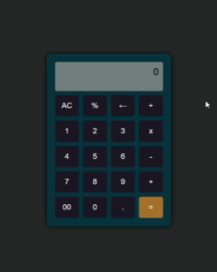

## Calculadora-HTML

Este é um projeto simples de interface gráfica de uma calculadora, desenvolvido com **HTML**. O objetivo é praticar estruturação de layout e organização visual de componentes em uma aplicação web.
Este projeto faz parte da minha jornada de estudos em Análise e Desenvolvimento de Sistemas. Estou explorando conceitos de front-end e preparando terreno para integrar lógica com JavaScript e futuramente publicar versões mais completas.

## Funcionalidades

- Interface responsiva com botões organizados
- Layout inspirado em calculadoras Digital
- Preparado para receber lógica com JavaScrip futuramente

## Tecnologias utilizadas

- HTML5

## Preview

## Como visualizar

1. Baixe ou clone o repositório
2. Abra o arquivo `calculadora.html` em qualquer navegador moderno
